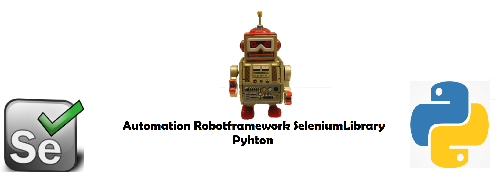

# Keyword Driven Robotframework SeleniumLibrary Automation Framework in Python

The purpose of the project is to display Keyword driven framework for web applications using SeleniumLibrary in Robotframework.

## Tools & Technologies

* Automation Tools : Robotframework SeleniumLibrary
* Language : Python
* Data driven Testing Framework : Excellib
* Object Repository Design Pattern : Page Object Model
* Test Execution Report:  Robotframework HTML 
* Test Execution Mode:  Parallel (usin Pabot)
* Browser Compatibility: Chrome and HeadlessChrome
* Screenshot:  Take screen shot API to cover the flow and caputer invalid screenshots
* Implicit and explicit wait
* Mouse action, Dropdown, Handling new tabs/windows,Scrolls,HTML Tables and handling browser Popup
* Assertions : Hard & Soft

## Project Structure

<p align="center">
<br />
</p>

* Helper:-
In this directory we will have centralized the functions we will using in the tests to perform steps, this way it keeps code clean and easy to maintain. If need to change won’t have to change in all tests in corresponding test file infact just change here. Next you will observe no hard-coded values used in any of helper functions all test data is centralized as well in ApplicationProperties.robot. We have CommonHelper.robot which holds common keywords which will be used repeatedly to achieve reusability 
  
* PageObjects :-
In this directory we will store objects relevant to pages to achieve reusability in Helper classes, easy to maintain lets say locator of any element is changed by developer you wont have to change every in helper classes in fact just change from here last but least it keeps the code clean . Ensure to use id, css, relative xpath, in some cases id’s might not be available try css and xpath (relative). We have CommonObjects.robot to hold objects tied to common keywords and will be used repeatedly .

* TestCases :-
In this directory we will write all test cases here . In each test case code is written using clean code practices like no hard-coded values and clear to read. Testcases are designed to handle to capture screenshot if any test fails.

* TestData:-
In this directory we have created ApplicationProperties.robot to store all test data centralized , easy to maintain if changes we can change here and don’t have to change every in tests. 

* Utility:-
In this directory we have Setup.robot which is responsible to start test for example opening browsers, navigating to website or closing browser to taking screenshot. Instead of writing all that code in every class we have made it code cleaner and abstracted and directly used in test cases. The other file here we have SeleniumKeywords.robot which is core of performing common re-usable SeleniumLibrary functions. We have centralized here this will easy to use and access, re-usbaility and keep code clean in Helper classes. 

* Reports:-
The complete html report and log is placed here. It has a screenshot folder which contains screenshot which we take and screenshot if any test fails.

* Requirements.txt:-
This file contains list of libraries installed in order to run test cases.

# How to Setup & Run the project:-
There are two ways:

* Documentation :- Complete Technical Documentation is present under Doc directory to follow step by step.
OR
* Download the code from repository and run following command. It will download all libraries automatically
```python
   pip install Requirments.txt
```
* Project Path :-You have to select proper project path. Project path should be your project location where .setting and pom file were exist. Import existing maven project and click on next button.
* Select the root directory the project is and Click Finish
* Run pom.xml File:- You have to run pom.xml file as maven test.


